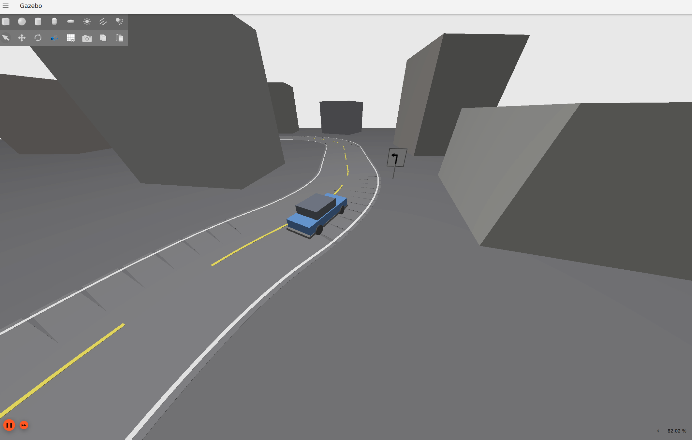
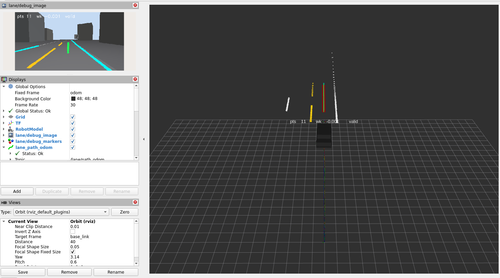

# vlm_av_ws

A ROS2 + Gazebo autonomous-driving simulation stack: vision-based lane perception, a curvature-aware local planner, and an OSQP QP model-predictive controller, running a full-size sedan through a generated urban road course.

This project is a continuation of [kfan12/vlm_robot_public](https://github.com/kfan12/vlm_robot_public).
It carries forward the same ROS2/Gazebo simulation approach, now built around a full-size sedan model (Ackermann steering, RGB-D front camera) instead of the original robot, and a more realistic generated road world with lane markings, curves, intersections, and street furniture.

**Status: under active development.**
The stack currently runs end to end (perception -> planning -> control -> sim), but tuning and new features are ongoing.
Expect frequent changes to camera/perception parameters, MPC weights, and the road-world generator as the project evolves.

## Screenshots

| Gazebo simulation | RViz (lane debug image + planned path) |
| --- | --- |
|  |  |

## Stack overview

| Package | Role |
| --- | --- |
| `sedan_description` | V2 full-size sedan URDF: 2.7 m wheelbase, Ackermann steering, windshield-height RGB-D camera. |
| `urban_gazebo` | Generated urban world/course tooling: road geometry, lane paint, signage, traffic-light control. |
| `robot_bringup` | Top-level launch files, `ros_gz` bridge configs, RViz config. |
| `av_perception_cpp` | `lane_node`: HSV-based lane-paint detection, chain clustering/merging, ground-plane projection, debug image/markers. |
| `av_behavior_cpp` | `local_planner` (curve splicing + speed profiling) and `mpc_tracker_v2` (OSQP QP tracker on a linearized bicycle model). |
| `robotcar_localization` | EKF configuration (`robot_localization`) fusing wheel odometry and IMU. |
| `av_common_cpp` | Shared C++ library: geometry/polyline math, projection, JSON map I/O, debug tap. |

Perception, planning, and control run as separate ROS2 nodes at their own rates, tied together through `av_stack.launch.py`, which also fans out the map's spawn pose so every node agrees on the same odom-frame origin.

## Running it

```bash
# build
colcon build
source install/setup.bash

# full stack: Gazebo + sedan + bridge + EKF + perception + planning + control + RViz
ros2 launch robot_bringup av_stack.launch.py

# a tighter-radius course, or without RViz
ros2 launch robot_bringup av_stack.launch.py world:=urban_tight
ros2 launch robot_bringup av_stack.launch.py rviz:=false

# tune the MPC without touching code
ros2 launch robot_bringup av_stack.launch.py mpc_config:=/path/to/mpc_params_tuned.yaml
```

See `src/robot_bringup/launch/av_stack.launch.py` for the full set of launch arguments (lane-detection debug surfaces, the local planner's road-curvature assist, etc).

## Roadmap

This is a work in progress.
Planned areas of continued work include further MPC/perception tuning, additional road-world variety, and expanded sensing/behavior features.
