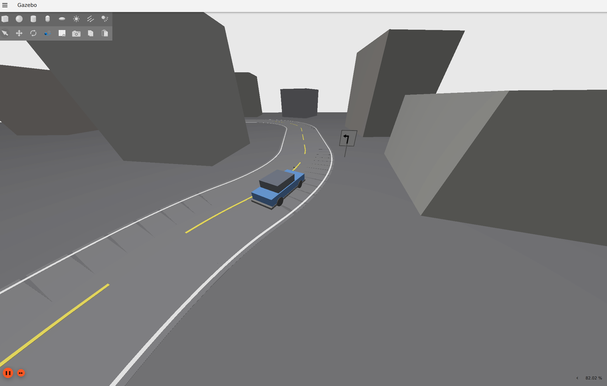
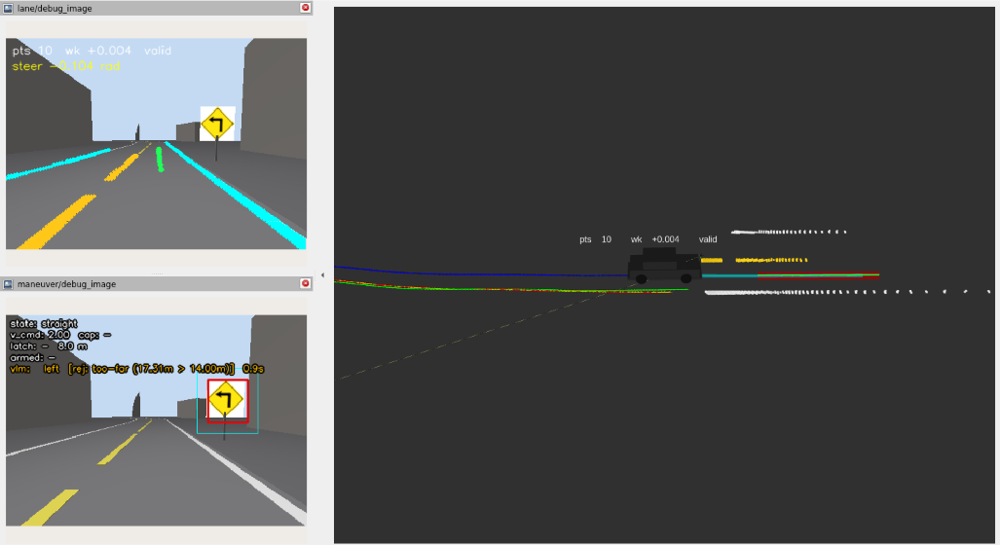

# vlm_av_ws

A ROS2 + Gazebo autonomous-driving simulation stack: vision-based lane perception, a curvature-aware local planner, and an OSQP QP model-predictive controller, running a full-size sedan through a generated urban road course.
A second pipeline layers a vision-language model on top: it reads road signs (stop / left / right / winding) from the front camera and turns them into speed caps and a stop, on top of the vision-only lane following.

This project is a continuation of [kfan12/vlm_robot_public](https://github.com/kfan12/vlm_robot_public).
It carries forward the same ROS2/Gazebo simulation approach, now built around a full-size sedan model (Ackermann steering, RGB-D front camera) instead of the original robot, and a more realistic generated road world with lane markings, curves, intersections, and street furniture.

**Status: under active development.**
The core stack runs end to end (perception -> planning -> control -> sim), and the VLM sign-reading pipeline (Qwen2.5-VL-3B) runs alongside it and drives the demo course (straight -> right 90 -> winding S -> left 90 -> STOP).
Tuning and new features are ongoing; expect frequent changes to camera/perception parameters, MPC weights, VLM sign-arbitration tuning, and the road-world generator as the project evolves.

## Screenshots

| Gazebo simulation | RViz (lane debug image + planned path) |
| --- | --- |
|  |  |

## Stack overview

| Package | Role |
| --- | --- |
| `sedan_description` | V2 full-size sedan URDF: 2.7 m wheelbase, Ackermann steering, windshield-height RGB-D camera. |
| `urban_gazebo` | Generated urban world/course tooling: road geometry, lane paint, signage, traffic-light control. |
| `robot_bringup` | Top-level launch files, `ros_gz` bridge configs, RViz config. |
| `av_perception_cpp` | `lane_node`: HSV-based lane-paint detection, chain clustering/merging, ground-plane projection, debug image/markers. |
| `av_behavior_cpp` | `local_planner` (curve splicing + speed profiling) and `mpc_tracker_v2` (OSQP QP tracker on a linearized bicycle model). |
| `robotcar_localization` | EKF configuration (`robot_localization`) fusing wheel odometry and IMU. |
| `av_common_cpp` | Shared C++ library: geometry/polyline math, projection, JSON map I/O, debug tap. |
| `vlm_planner_py` | VLM sign pipeline: `vlm_sign_node` (Qwen2.5-VL-3B sign reading) + `sign_maneuver_node` (board detection, sign-to-speed arbitration). Runs under a separate Python venv (torch); see below. |

Perception, planning, and control run as separate ROS2 nodes at their own rates, tied together through `av_stack.launch.py`, which also fans out the map's spawn pose so every node agrees on the same odom-frame origin.
The VLM pipeline runs as two extra nodes launched separately (not part of `av_stack.launch.py`, since it needs the torch venv) and only ever *caps* speed or adds a stop - it never steers, so the stack still drives lane-only with it off.

## VLM sign pipeline

Two nodes, both under `vlm_planner_py`, run in the torch venv alongside (not inside) `av_stack.launch.py`:

- **`vlm_sign_node`** - subscribes to the front camera, classifies the nearest/latched road sign with Qwen2.5-VL-3B-Instruct (4-bit, on its own ~0.5 Hz timer since inference takes ~2 s) and publishes `/vlm/sign` (`{"sign": <label>, "stamp": <capture time>}`, label in `{right,left,winding,stop,none,unparsed}`) plus an annotated `/vlm/sign_image`.
  It loads the model at startup, not on first frame, because the cold load (~2-3 min) pegs the CPU and would otherwise starve the Gazebo camera render and trip the MPC's path-stale safety.
- **`sign_maneuver_node`** - detects candidate sign boards from the depth image (elevated blob + color gate), latches one board by odom position, hands its pixel ROI to `vlm_sign_node` so Qwen reads the latched board instead of the nearest board-shaped thing, and runs the v1 `SignLabelLatch` / `ManeuverStateMachine` arbitration on the result.
  It publishes `/maneuver/target_speed` (absolute setpoint) and `/maneuver/state` (state name); `mpc_tracker_v2` takes `min(planner speed profile, this setpoint)`, so a sign can only lower speed, never steer or raise it.
  A `left`/`right` state also selects the MPC's turn-mode heading lookahead.
  `/vlm/sign_maneuver` publishes the full diagnostic JSON (maneuver, speed cap, stop distance, sign latch state) for the demo's narrative pane.

Tunables (camera geometry, board-detection z/x/y bands, color gate, label band, cruise/turn/winding speed caps, stop creep + standoff) live in `src/vlm_planner_py/config/sign_maneuver_params.yaml`; copy it per tuning cycle rather than editing code.

Requires a Python venv with `torch`, `transformers`, and (for the 4-bit GPU path) `bitsandbytes` - default location `~/venvs/vlm_robot` (override with `VLM_VENV`).
Without a CUDA GPU, Qwen falls back to full-precision CPU inference, which is slow enough to be impractical for the live demo.

Run it manually (two extra terminals, after `av_stack.launch.py` is up):

```bash
source ~/venvs/vlm_robot/bin/activate
python3 -m vlm_planner_py.vlm_sign_node --ros-args -p use_sim_time:=true -p vlm_query_rate_hz:=0.5
# wait for the "VLM ready" log line, then:
python3 -m vlm_planner_py.sign_maneuver_node --ros-args \
    --params-file src/vlm_planner_py/config/sign_maneuver_params.yaml -p use_sim_time:=true
```

Toggle Qwen querying live, without restarting: `ros2 param set /vlm_sign vlm_query_enabled false|true`.

## Running it

The easiest way to see the full demo (sim + both VLM nodes + narrative panes) is the course-demo script, which lays a 3x2 `terminator` grid: VLM pipeline + `av_stack` launch in column 1, live sign/maneuver narrative in column 2, topic-rate health + a free shell in column 3.

```bash
# build
colcon build
source install/setup.bash

./scripts/start_course_demo.sh
# ./scripts/start_course_demo.sh waits for the "VLM ready" marker before
# starting the sim; skip the wait, or pick a world, with:
STACK_NOWAIT=1 ./scripts/start_course_demo.sh
DEMO_WORLD=urban_tight ./scripts/start_course_demo.sh
```

Teardown is closing the terminator window; each pane's job dies with it.

For the vision-only stack (no VLM, lane-following and turns only, no sign speed caps or stop), or to drive its launch args directly:

```bash
# full stack: Gazebo + sedan + bridge + EKF + perception + planning + control + RViz
ros2 launch robot_bringup av_stack.launch.py

# a tighter-radius course, or without RViz
ros2 launch robot_bringup av_stack.launch.py world:=urban_tight
ros2 launch robot_bringup av_stack.launch.py rviz:=false

# tune the MPC without touching code
ros2 launch robot_bringup av_stack.launch.py mpc_config:=/path/to/mpc_params_tuned.yaml
```

See `src/robot_bringup/launch/av_stack.launch.py` for the full set of launch arguments (lane-detection debug surfaces, the local planner's road-curvature assist, etc), and `scripts/start_course_demo.sh --help`-style comments at the top of that file for the demo script's env vars.

## Roadmap

This is a work in progress.
Planned areas of continued work include further MPC/perception tuning, further VLM sign-arbitration robustness (board latch, ROI hand-off) tuning, additional road-world variety, and expanded sensing/behavior features.
